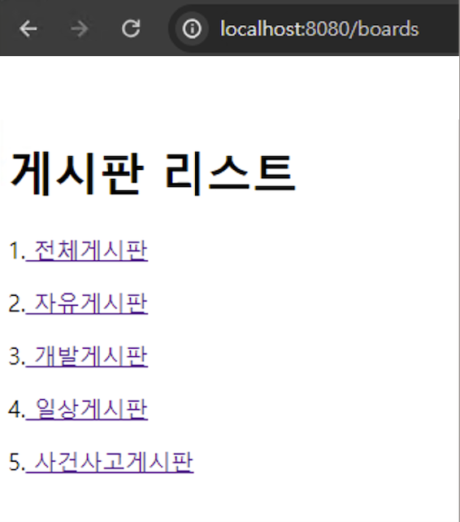
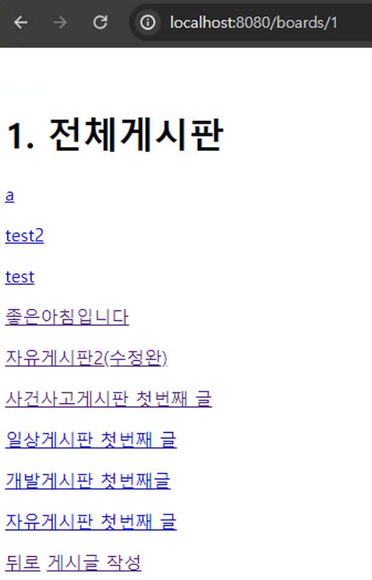
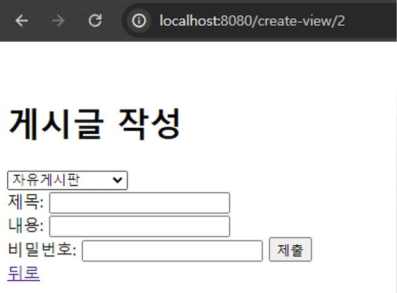
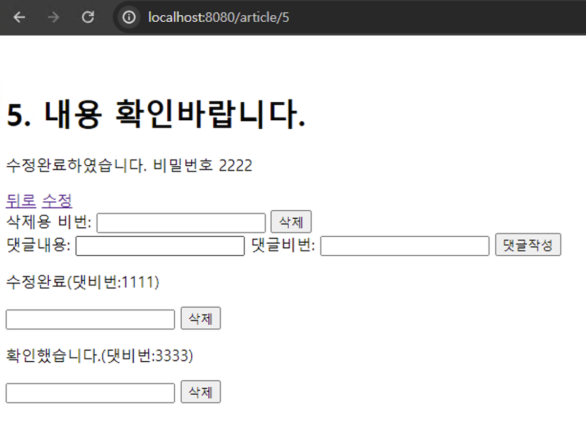
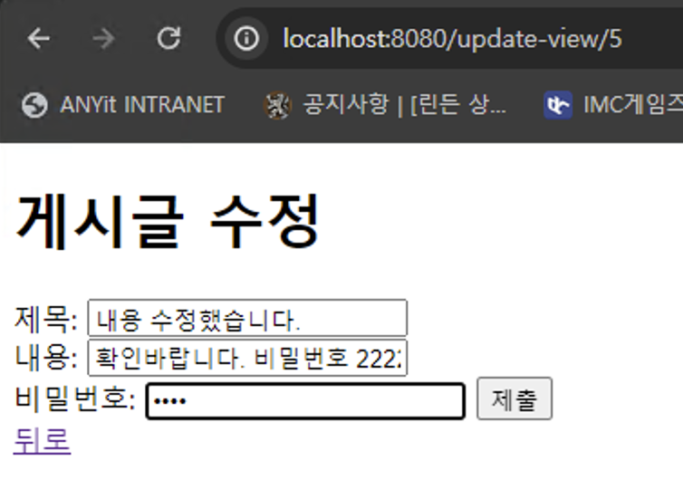
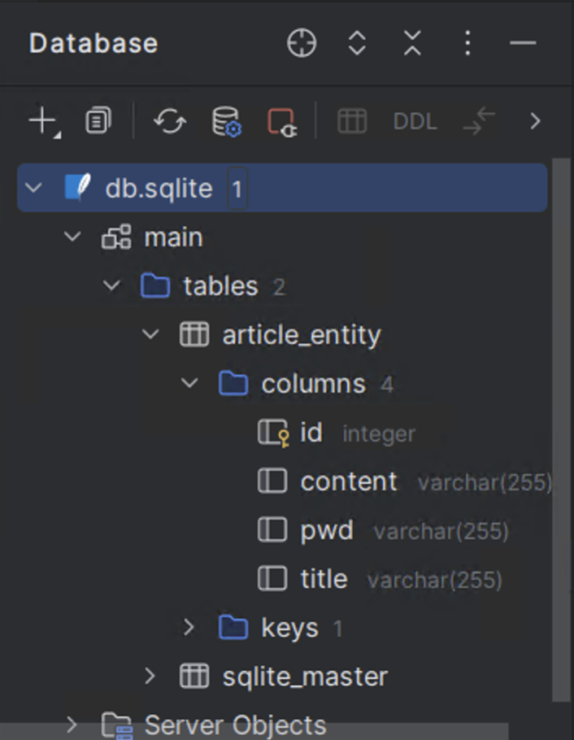
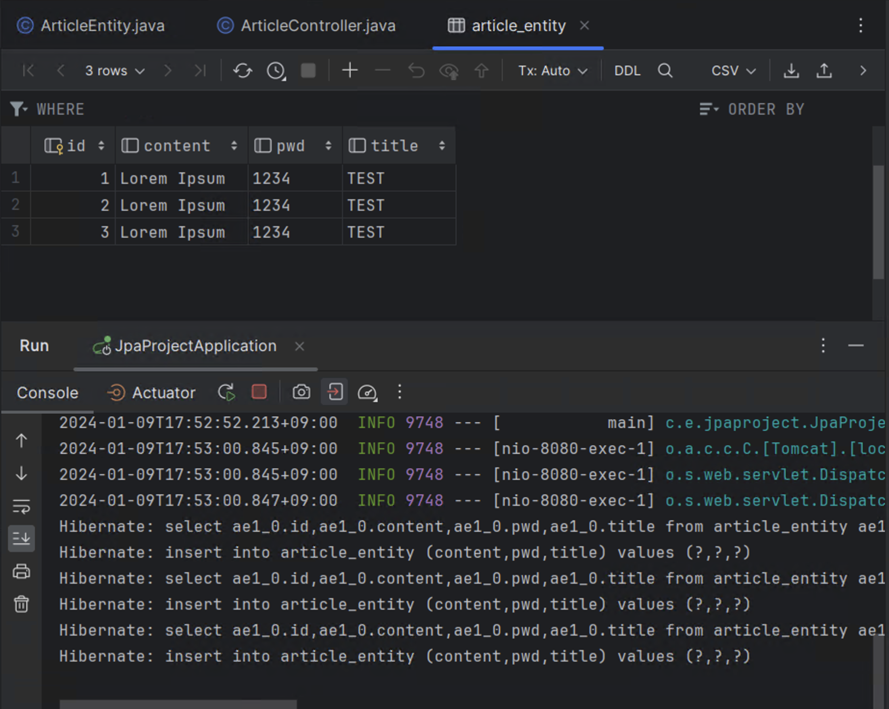

## 프로젝트 이름 
익명 의견 교환 웹 페이지

<br>

## 프로젝트 개요
이 프로젝트는 이때까지 배운 Java, Spring Boot, Thymeleaf, SQLite 등을 활용하여 "익명 의견 교환 웹 페이지"를 만드는 것을 목표로 하고 있습니다. "익명 의견 교환 웹 페이지"는 사용자들이 자기 자신의 정보를 직접 드러낼 필요 없이 의견을 교환할 수 있는 웹 페이지 입니다. 

<br>

## 기능
- 게시판 관련 기능
- 게시글 관련 기능
- 댓글 관련 기능

<br>

## 사용방법
1. 레포지토리를 클론한다.
  - https://github.com/min2023237/Mission_YangSoMin.git
2. IntelliJ로 프로젝트 열고 서버를 실행한다.
3. `localhost:8080`에 접속하여 `게시판 목록`을 누르면 `게시판 리스트`가 나온다.
    
4. `전체게시판`은 전체 게시글 목록이 나오고, `자유게시판`, `개발게시판`,`일상게시판`, `사건사고게시판`은 각각의 게시판에 해당하는 게시글을 조회할 수 있다.
    
<br>

5. 각각의 게시판에 있는 `게시글 작성`을 누르면 `게시글 작성 화면`으로 이동한다.
    
<br>

6. 게시글을 작성하고 `제출`을 누르면, 작성된 게시글의 `게시판`으로 이동한다.
7. `게시판`에서 `게시글`을 누르면 `게시글 조회 화면`이 나온다. 
    
    - `수정`을 누르면 `게시글 수정 화면`으로 이동한다
    - 게시글 작성시 입력했던 `비밀번호`를 제출하면 게시글 `삭제`도 가능하다. 
    - `댓글`을 작성할 수 있으며,  `댓글 목록`을 조회할 수 있고, `비밀번호`를 입력하여 댓글을 `삭제`할 수도 있다.

8. `게시글 수정 화면`에서는 게시글 작성시 입력했던 비밀번호를 입력하여 게시글의 내용을 수정할 수 있다.
     
<br>

## 프로젝트 진행 과정
### 1) 프로젝트 생성 및 설정
1. `Spring Initializr`에서 아래 의존성을 추가하여 프로젝트 생성하고 IntelliJ IDEA로 프로젝트를 열었다.
    - Spring Web
    - Thymeleaf
    - Spring Data JPA
    - Lombok

2. build.gradle 파일에 SQLite 관련 의존성을 추가하고, 코끼리 버튼을 눌러 동기화하였다.
    ```
      // sqlite
        runtimeOnly 'org.xerial:sqlite-jdbc:3.41.2.2'
        runtimeOnly 'org.hibernate.orm:hibernate-community-dialects:6.2.4.Final'
    ```

3. application.properties 파일을 application.yaml 파일로 변경한 다음, JPA 및 데이터베이스 관련 설정을 추가하였다.
    ```
    spring:
      datasource:
        url: jdbc:sqlite:db.sqlite
        driver-class-name: org.sqlite.JDBC
      jpa:
        hibernate:
          ddl-auto: create
        show-sql: true
        database-platform: org.hibernate.community.dialect.SQLiteDialect
    ```

4. `Run`을 눌러 실행이 잘 되는지 확인한 후 종료하고, 프로젝트 가장 상위 폴더에서 우클릭 후 `Reload from Disk`를 클릭하여 `db.sqlite`가 생성되었는지 확인하였다.

<br>

### 2) CRUD 작업 - Article
1. Article Entity 클래스 생성:
    - src/main/java 내에 com.example.jpaproject 아래에 `entity`라는 이름으로 새 패키지를 생성하였다.
    - `entity`패키지 아래에 `ArticleEntity`클래스를 생성한다.
    - 클래스에 `@Entity` 어노테이션과 `@Data` 어노테이션을 추가하고, 아래의 필드를 정의하였다.
        - 게시글의 고유 id
        - 제목
        - 내용
        - 비밀번호
    - `게시글의 고유 id`필드에는 `@Id`와 `@GeneratedValue(strategy = GenerationType.IDENTITY)` 어노테이션을 붙여주었다.
    - `Run`을 눌러 실행하여 `console`에서 아래와 같은 내용을 확인하여 정상적으로 진행되고 있음을 알 수 있었다.
      ```
      Hibernate: drop table if exists article_entity
      Hibernate: create table article_entity (id integer, articlepw varchar(255), content varchar(255), title varchar(255), primary key (id))
      ```

2. IntelliJ IDEA에서 SQLite 데이터 소스를 추가하였다. 이때, File을 `db.sqlite`로 설정하였다. 데이터베이스 탭에서 `artice_entity`라는 테이블이 만들어진 것을 확인하였다.


3. Repository 인터페이스 생성:
    - src/main/java 내에 com.example.jpaproject 아래에 `repo`라는 이름으로 새 패키지를 생성하고, `ArticleRepository`라는 인터페이스를 만들었다.
    - JpaRepository를 상속받았다.

4. Controller 클래스 생성:
    - src/main/java 내에 com.example.jpaproject 아래에 ArticleController 클래스를 생성.
    - @RestController 어노테이션과 @RequiredArgsConstructor 어노테이션을 추가.
    - 먼저 `CREATE` 관련 경로 및 메서드를 정의하고, 데이터가 정상적으로 들어오는지 확인하였다.  
      ```JAVA
      @RestController
      @RequiredArgsConstructor
      public class ArticleController {
          private final ArticleRepository repository;

          Long nextId = 1L;


          @GetMapping("/create")
          public String create() {

              ArticleEntity article = new ArticleEntity();

              nextId++;
              article.setId(nextId);
              article.setTitle("Test");
              article.setContent("Lorem Ipsum");
              article.setPwd("1234");

              repository.save(article);

              return "Done.";
      ```
      

    - `READ ONE`, `UPDATE`, `DELETE`관련 경로와 메서드도 정의하고, 기능이 정상적으로 작동하는지 테스트 하였다.
      ```JAVA
        //READ ONE
        @GetMapping("/article/{id}")
        public String readOne(
                @PathVariable("id")
                Long id
        ) {
            Optional<ArticleEntity> optionalArticle = repository.findById(id);

            if(optionalArticle.isPresent()) {
                System.out.println("found: "+ id);
                System.out.println(optionalArticle.get());
            }

            return "done";
        }

        //UPDATE ARTICLE
        @GetMapping("/article/{id}/update")
        public String update(
                @PathVariable("id")
                Long id
        ) {
            Optional<ArticleEntity> targetOptional = repository.findById(id);
                if(targetOptional.isPresent()) {
                    System.out.println("Target Found!");
                    ArticleEntity target = targetOptional.get();
                    target.setTitle("UPDATED TITLE");
                    target.setContent("UPDATED CONTENT");
                    repository.save(target);
                }
                return "UPDATE SUCCESSFUL!";
        }

        //DELETE ARTICLE
        @GetMapping("/article/{id}/delete")
        public String delete(
                @PathVariable("id")
                Long id
        ) {
            Optional<ArticleEntity> targetOptional = repository.findById(id);
            if (targetOptional.isPresent()) {
                System.out.println("DELETE TARGET FOUND!");
                ArticleEntity target = targetOptional.get();
                repository.delete(target);
            }
            return "DELETE SUCCESSFUL!";
        }
      ```

5. Service 클래스 생성:
  - src/main/java 내에 com.example.jpaproject 아래에 ArticleService 클래스를 생성.
  - `@Service` 어노테이션 추가
  - `ArticleService` 내부(중괄호 안)에 `ArticleRepository`를 인젝트(Inject)
  - `@RequiredArgsConstructor` 어노테이션 추가
  - CRUD 관련 로직을 `ArticleController`에서 `ArticleService`로 이동
    ```JAVA
      @Service 
      @RequiredArgsConstructor 
      public class ArticleService { 
        private final ArticleRepository repository;

        //Long nextId = 1L;

        //CREATE ARTICLE
        public void create(
                String title,
                String content,
                String pwd
        ) {
            ArticleEntity article = new ArticleEntity();

            article.setTitle(title);
            article.setContent(content);
            article.setPwd(pwd);

            repository.save(article);

        }

        //READ ONE
        public ArticleEntity readOne(
                Long id
        ) {
            Optional<ArticleEntity> optionalArticle = repository.findById(id);
            return optionalArticle.orElse(null);
        }

        //UPDATE ARTICLE
        public void update(
                Long id,
                String title,
                String content,
                String pwd
        ) {
            ArticleEntity target = readOne(id);
            target.setTitle(title);
            target.setContent(content);
            repository.save(target);
        }

        //DELETE ARTICLE
        public void delete(
                Long id
        ) {
            repository.deleteById(id);
        }
      }
    ```
  -  `ArticleController`에서 `ArticleRepository` 대신 `ArticleService`를 사용하도록 변경.
    ```JAVA
    @RestController 
    @RequiredArgsConstructor 
    public class ArticleController {

      //private final ArticleRepository repository;
      private final ArticleService articleService;


      //CREATE ARTICLE

      @GetMapping("/create")
      public String create() {

          articleService.create("test", "test", "1234");

          return "CREATE SUCCESSFUL!";
      }

      //READ ONE
      @GetMapping("/article/{id}")
      public String readOne(
              @PathVariable("id")
              Long id
      ) {
          System.out.println(articleService.readOne(id));
          return "READ ONE SUCCESSFUL!";
      }

      //UPDATE ARTICLE
      @GetMapping("/article/{id}/update")
      public String update(
              @PathVariable("id")
              Long id
      ) {
              articleService.update(id, "UPDATED TITLE", "UPDATED CONTENT", "1234");
              return "UPDATE SUCCESSFUL!";
      }

      //DELETE ARTICLE
      @GetMapping("/article/{id}/delete")
      public String delete(
              @PathVariable("id")
              Long id
      ) {
          articleService.delete(id);
          return "DELETE SUCCESSFUL!";
      }
    }
    ```

### 3) 웹 페이지 구현 및 연결 - Article
1. HTML 파일 생성 - `create`
- `src/main/resources/templates` 디렉토리에 `create.html` 파일을 생성.
    ```html
    <!DOCTYPE html>
    <html lang="en">
    <head>
        <meta charset="UTF-8">
        <title>게시글 작성</title>
    </head>
    <body>
    <h1>게시글 작성</h1>
    <form action="/create" method="post">
        <label for="title-input">
            제목: <input id="title-input" name="title">
        </label><br>
        <label for="content-input">
            내용: <input id="content-input" name="content">
        </label><br>
        <label for="pwd-input">
            비밀번호: <input id="pwd-input" type="password" name="pwd">
        </label>
        <input type="submit">
    </form>
    </body>
    </html>
    ```
2. `ArticleController` 수정 - `create`
- `@RestController` 어노테이션을 `@Controller` 어노테이션으로 바꾸어준다.
- 아래와 같이 코드를 수정하고 테스트를 진행하여 정상적으로 게시물이 생성되는 것을 확인하였다.
    ```JAVA
    @RequiredArgsConstructor
    @Controller
    public class ArticleController {
        
        private final ArticleService articleService;

        @GetMapping("/create-view")
        public String createView() {
            return "create";
        }

        @PostMapping("/create")
        public String create(
                @RequestParam("title")
                String title,
                @RequestParam("content")
                String content,
                @RequestParam("pwd")
                String pwd,
        ) {
            //CREATE
            articleService.create(title, content, pwd);

            System.out.println(title);
            System.out.println(content);
            return "redirect:/create-view";
        }
    ```
3. HTML 파일 생성 - `read`, `update`
- `create`와 마찬가지로 `read.html`과 `update.html`을 차례차례 생성하였다.
4. `ArticleController` 수정 - `read`, `update`, `Delete`
- Controller에서 `read`와 `update`, `Delete`에 관련된 메서드를 만들어주고 테스트를 하여 데이터가 정상적으로 읽어지고, 수정되고, 삭제됨을 확인하였다.

### 3) CRUD 작업과 웹페이지 구현 및 연결 - Board
1. `BoardEntity`생성
    ```JAVA
    @Data
    @Entity
    public class BoardEntity {
        @Id
        @GeneratedValue(strategy = GenerationType.IDENTITY)
        private Long id;
        private String name;
    }
    ```
2. `BoardRepository` 생성
    ```JAVA
    public interface BoardRepository
            extends JpaRepository<BoardEntity, Long> {
    }
    ```
3. `BoardService` 클래스를 생성하고 CRUD 기능 추가
    ```JAVA
    @Service
    @RequiredArgsConstructor
    public class BoardService {
        private final BoardRepository repository;

        //CREATE BOARD
        public void create(
                String name
        ) {
            BoardEntity board = new BoardEntity();
            board.setName(name);
            repository.save(board);
        }

        //READ ALL
        public List<BoardEntity> readBoardAll() {
            return repository.findAll();
        }

        //READ ONE
        public BoardEntity readBoard(Long id) {
            return repository.findById(id).orElse(null);
        }

    }
    ```
4. `BoardController` 생성
    ```JAVA
    @Controller
    @RequiredArgsConstructor
    public class BoardController {
        private final BoardService boardService;
        private final ArticleService articleService;

        @GetMapping("/")
        public String home() {
            return "home";
        }

        //CREATE
        @GetMapping("board/{name}/create")
        public String create(
                @PathVariable("name")
                String name
        ) {

            boardService.create(name);

            return "redirect:/boards";

        }

        //READ ALL
        @GetMapping("boards")
        public String readAll(Model model) {
            model.addAttribute("boards", boardService.readBoardAll());
            return "board/home";
        }

        //READ ONE
        @GetMapping("boards/{id}")
        public String readOne(
                @PathVariable("id")
                Long id,
                Model model
        ) {
            model.addAttribute("board", boardService.readBoard(id));
            return "board/read";
        }


    }
    ```
5. 게시판 리스트를 불러오는 화면(`board/home.html`) 작성.
    ```html
    <!DOCTYPE html>
    <html lang="en" xmlns:th="http://www.thymeleaf.org/">
    <head>
        <meta charset="UTF-8">
        <title>HOME</title>
    </head>
    <body>
    <h1>게시판 리스트</h1>
    <div th:if="${boards.isEmpty()}">
        No Boards Here...
    </div>
    <div th:unless="${boards.isEmpty()}" th:each="board: ${boards}">
        <p>
            [[${board.id}]].<a th:href="@{/boards/{id}(id=${board.id})}"> [[${board.name}]]</a>
        </p>
    </div>
    </body>
    </html>
    ```

6. 게시물 리스트를 볼 수있는 게시판 화면(`board/read.html`)작성
    ```html
    <!DOCTYPE html>
    <html lang="en" xmlns:th="http://www.thymeleaf.org/">
    <head>
        <meta charset="UTF-8">
        <title>READ</title>
    </head>
    <body>
    <h1>[[${board.id}]]. [[${board.name}]]</h1>
    <div th:if="${board.isEmpty()}">
            No Articles Here...
    </div>
    <div th:unless="${board.isEmpty()}" >
        <p>Articles</p>
    </div>
    <a href="/boards">뒤로</a>
    </body>
    </html>
    ```

<br>

### 4) `게시판(Board)`과 `게시글(Article)` 연결
1. `BoardEntity`, `ArticleEntity`수정
    ```JAVA
    // BoardEntity
    @OneToMany(mappedBy = "board")
    private List<ArticleEntity> articles;

    ```

    ```JAVA
    //ArticleEntity
    @ManyToOne
    private BoardEntity board;
    ```

<br>

### 5.) `게시글(Article)`작성할 때 `게시판(Board)`선택하는 기능 구현
1. `ArticleController`수정
    ```JAVA
    @Controller
    @RequiredArgsConstructor
    public class ArticleController {

      //BoardService 주입
      private final BoardService boardService;

      //CREATE VIEW
        @GetMapping("/create-view/{id}")
        public String creatView(
                @PathVariable
                Long id,
                Model model
        ) {
            model.addAttribute("boards", boardService.readBoardAll());
            model.addAttribute("boardId", id);
            return "article/create";
        }

      //CREATE ARTICLE
        @PostMapping("/create")
        public String create(
                @RequestParam("title")
                String title,
                @RequestParam("content")
                String content,
                @RequestParam("pwd")
                String pwd,
                @RequestParam("board-id")
                Long boardId
        ) {
            articleService.create(title, content, pwd, boardId);

            return "redirect:/boards/"+boardId;
        }

    ```
2. `article/create.html`수정
    ```html
    <label>
        <select name="board-id">
          <option
            th:each="board: ${boards}"
            th:value="${board.id}"
          >
            [[${board.name}]]
          </option>

        </select>
      </label><br>
    ```

<br>

### 6) `특정 게시판`을 선택하면 `그 게시판에 해당하는 게시물`만 나오게 하는 기능 구현
1. `ArticleRepository`수정
    ```JAVA
    public interface ArticleRepository
            extends JpaRepository<ArticleEntity, Long> {
        List<ArticleEntity> findAllByBoardId(Long id);
    }
    ```
2. `ArticleService` 수정
    ```JAVA
    //READ ALL - boardId
        public List<ArticleEntity> readAllByBoardId(
                Long boardId
        ) {
            return articleRepository.findAllByBoardId(boardId);
        }
    ```
3. `BoardController`수정
    ```JAVA
    //READ ONE
        @GetMapping("boards/{id}")
        public String readOne(
                @PathVariable("id")
                Long id,
                Model model
        ) {
            model.addAttribute("board", boardService.readBoard(id));
            model.addAttribute("articles", articleService.readAllByBoardId(id));
            return "board/read";
        }
    ```

4. `board/read.html`수정
    ```html
    <!DOCTYPE html>
    <html lang="en" xmlns:th="http://www.thymeleaf.org/">
    <head>
        <meta charset="UTF-8">
        <title>READ</title>
    </head>
    <body>
    <h1>[[${board.id}]]. [[${board.name}]]</h1>
    <div th:if="${board.isEmpty()}">
            No Articles Here...
    </div>
    <div th:unless="${board.isEmpty()}" th:each="article: ${articles}">
        <p><a th:href="@{/article/{id}(id=${article.id})}"> [[${article.title}]]</a></p>
    </div>
    <a href="/boards">뒤로</a>
    <a th:href="@{/create-view/{id}(id=${board.id})}">게시글 작성</a>
    </body>
    </html>
    ```

<br>

### 7) 댓글 기능 구현
1. `CommentEntity` 생성
    ```JAVA
    @Data
    @Entity
    public class CommentEntity {
        @Id
        @GeneratedValue(strategy = GenerationType.IDENTITY)
        private Long id;

        private String content;
        private String password;

        //댓글은 하나의 게시글에 속함
        @ManyToOne
        private ArticleEntity article;
    }
    ```
2. `CommentRepository` 생성
    ```JAVA
    public interface CommentRepository
            extends JpaRepository<CommentEntity, Long> {
        List<CommentEntity> findAllByArticleId(Long articleId);
    }
    ```
3. `CommentService` 생성
    ```JAVA
    @Service
    public class CommentService {
        private final ArticleRepository articleRepository;
        private final CommentRepository commentRepository;

        public CommentService(
                ArticleRepository articleRepository,
                CommentRepository commentRepository
        ) {
            this.articleRepository = articleRepository;
            this.commentRepository = commentRepository;
        }

        //CREATE COMMENT
        public void create(
                String content,
                String password,
                Long articleId
        ) {
            CommentEntity comment = new CommentEntity();
            comment.setContent(content);
            comment.setPassword(password);
            comment.setArticle(articleRepository.findById(articleId).orElse(null));
            commentRepository.save(comment);
        }

        // READ ALL
        public List<CommentEntity> readAll(
                Long articleId
        ) {
            return commentRepository.findAllByArticleId(articleId);
        }

        // DELETE
        public void delete(
                Long articleId,
                String password
        ) {
            Optional<CommentEntity> targetOptional = commentRepository.findById(articleId);
            CommentEntity target = targetOptional.get();
            if(targetOptional.isPresent() && target.getPassword().equals(password)) {
                commentRepository.delete(target);
            }
        }

    }
    ```
4. `ArticleController` 수정
    ```JAVA
    //READ ONE - ARTICLE
        @GetMapping("/article/{id}")
        public String readOne(
                @PathVariable("id")
                Long id,
                Model model
        ) {
            model.addAttribute("articles", articleService.readOne(id));
            model.addAttribute("comments", commentService.readAll(id));
            return "article/read";
        }
        
    //CREATE COMMENT
        @PostMapping("/article/{id}/comment")
        public String createComment(
                @PathVariable
                Long id,
                @RequestParam
                String content,
                @RequestParam
                String password
        ) {
            commentService.create(content, password, id);
            return "redirect:/article/" + id;
        }

    //DELETE COMMENT
        @PostMapping("/article/{id}/comment/{commentId}/delete")
        public String deleteComment(
                @PathVariable("id")
                Long id,
                @PathVariable("commentId")
                Long commentId,
                @RequestParam("password")
                String password
        ) {
            commentService.delete(commentId, password);
            return "redirect:/article/" + id;
        }
    ```
5. `article/read.html` 수정
    ```html
    <!-- 댓글 작성-->
    <div>
        <form th:action="@{/article/{id}/comment(id=${articles.id})}" method="post">
            <label for="content-input">
                댓글내용: <input id="content-input" type="text" name="content">
            </label>
            <label for="password-input">
                댓글비번: <input id="password-input" type="password" name="password">
            </label>
            <button type="submit">댓글작성</button>
        </form>
    </div>

    <!--댓글 목록-->

    <div th:if="${comments.isEmpty()}">
        No Comments Here...
    </div>
    <div th:unless="${comments.isEmpty()}" th:each="comment: ${comments}">
        <p>[[${comment.content}]]</p>
        <form th:action="@{/article/{id}/comment/{commentId}/delete(id=${articles.id}, commentId=${comment.id})}" method="post">
            <input type="password" name="password">
            <button type="submit">삭제</button>
        </form>
    </div>
    ```

<br>

### 8) `게시글 작성 화면`에 `게시판 지정` 기능 구현
1. `board/read.html`수정
    ```html
    <a th:href="@{/create-view/{id}(id=${board.id})}">게시글 작성</a>
    ```

2. `ArticleController`수정
    ```JAVA
    //CREATE VIEW
        @GetMapping("/create-view/{id}")
        public String creatView(
                @PathVariable
                Long id,
                Model model
        ) {
            model.addAttribute("boards", boardService.readBoardAll());
            model.addAttribute("boardId", id);
            return "article/create";
        }
    ```


3. `article/create.html` 수정
    ```html
    <label>
        <select name="board-id">
          <option
            th:each="board: ${boards}"
            th:value="${board.id}"
            th:selected="${board.id == boardId}"
          >
            [[${board.name}]]
          </option>

        </select>
      </label><br>
    ```

<br>

### 9) `게시글 정렬` 기능 구현
- 참고 : [[Spring Data JPA] - 정렬과 페이징 처리](https://qpdh.tistory.com/211)
1. `ArticleRepository`에서 `findAllByBoardId`를 아래와 같이 수정.
    ```JAVA
    List<ArticleEntity> findAllByBoardId(Long id, Sort sort);
    ```

2. `ArticleService`에서 `readAllByBoardId`를 아래와 같이 수정
    ```JAVA
    //READ ALL - boardId
    public List<ArticleEntity> readAllByBoardId(
            Long boardId
    ) {
        return articleRepository.findAllByBoardId(boardId, Sort.by(Sort.Order.desc("id")));
    }
    ```

<br>

### 10) `전체게시판`일 경우 `전체 게시물`이 나오는 기능 구현
1. `ArticleRepository`수정
    ```JAVA
    List<ArticleEntity> findAllByBoardId(Long id, Sort sort);
    ```

2. `ArticleService`수정
    ```JAVA
    //READ ALL
        public List<ArticleEntity> readAll() {
            return articleRepository.findAll(Sort.by(Sort.Order.desc("id")));
        }
    ```

3. `BoardController`수정
    ```JAVA
    //READ ONE
        @GetMapping("boards/{id}")
        public String readOne(
                @PathVariable("id")
                Long id,
                Model model
        ) {
            model.addAttribute("board", boardService.readBoard(id));
            model.addAttribute("articles", articleService.readAllByBoardId(id));
            model.addAttribute("allArticles", articleService.readAll());
            return "board/read";
        }
    ```

3. `board/read.html`수정
    ```html
    <div th:if="${board.id} == 1" th:each="article: ${allArticles}">
        <p><a th:href="@{/article/{id}(id=${article.id}, orderby=id)}"> [[${article.title}]]</a></p>
    </div>
    <div th:unless="${board.id} == 1" th:each="article: ${articles}">
        <p><a th:href="@{/article/{id}(id=${article.id})}"> [[${article.title}]]</a></p>
    </div>
    ```
