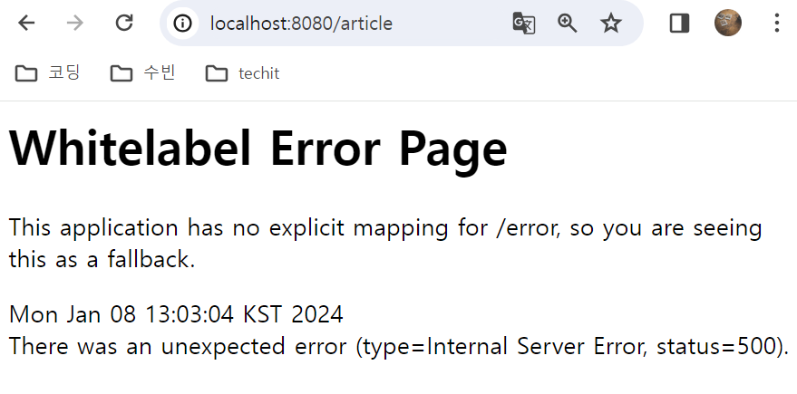

### 오류
1. 실행했을 때 오류가 발생함 -> 해결
    - articleController에서 클래스 위의 @RequiredMapping("article")이라고 작성한 뒤 다른 프로젝트 처럼 return "article/index";로 작성했는데 접속오류가 발생
    - return부분에 article 부분을 지우니 잘 실행됨
    - -> board 만들기 전의 오류 상황, board를 만들고 난 이후 @RequiredMapping이 `@RequestMapping("board/{boardId}/article")`으로 바뀌어서 return 값도
      `return String.format("board/%d/article/index", boardId);`으로 수정하니 잘 실행됨


2. 비밀번호 확인 과정 -> 해결
    - 처음에는 비밀번호 확인 하려고 하는 경우 check.html로 넘어가서 확인하고 다시 update하려고 시도했으나
        - controller에서 mapping이 잘못됐는지 check.html로 넘어가는 것이 아닌 index.html로 넘어감
        - edit.html에서 script로 비밀번호를 확인하고 일치하면 수정, index.html로 넘어가기/ 불일치하면 edit 페이지에 머무르는 방식으로 바꿈
    - 비밀번호 불일치에도 update
        - 비밀번호가 맞지 않아도 alert가 작동하지 않고 수정되는 경우가 발생
        - 변수명이 일치하지 않어서 생기는 오류였음


3. comment 수정 링크, 삭제링크 -> 해결
    - comment 를 수정/삭제하기 위한 링크가 제대로 작동하지 않음
        - Article 수정 페이지로 이동함
        - commentController에서 매핑할 때 경로가 일치하지 않아서 생기는 오류였음


4. 게시글 역순으로 출력 -> 해결
    - 게시글을 역순으로 출력하기 위해 `#numbers.sequence`을 이용하여 작성했는데 오류가 발생
   ```html
        <tr th:each="article: ${#numbers.sequence(articles.size() - 1, 0, -1)}">
          <th scope="col" th:text="${article.id}"></th>
          <th scope="col">
              <a th:href="@{/article/{id}(id=${article.id})}" th:text="${article.title}"></a>
          </th>
        </tr>
      ```
    - index를 추가하여  오류 해결
   ```html
        <tr th:each="index: ${#numbers.sequence(articles.size() - 1, 0, -1)}">
          <th scope="col" th:text="${articles[index].id}"></th>
          <th scope="col">
              <a th:href="@{/article/{id}(id=${articles[index].id})}" th:text="${articles[index].title}"></a>
          </th>
        </tr>
   ```
5. 링크 이동이 제대로 되지 않음 -> 해결
   - `<form th:action="@{board/{boardId}/article/{id}/delete(boardId=${boardId},id=${article.id})}" method="post" onsubmit="return validatePassword();">`
   - 위의 코드에서 @{/board라고 입력해야 하는데 '/'를 쓰지않아서 링크 이동이 제대로 되지 않았다.
   - / 붙여서 실행하니 잘 작동함


6. 어떤 게시판에 작성할지 선택 가능
    - 맨 처음 화면에서 게시판을 선택하고 게시글을 작성할때 그 게시판에 게시글이 작성됨
    - 게시글을 작성할때 option으로 게시판을 선택할 수 있게 했는데 처음 선택한 게시판과 다른 게시판을 선택하면 수정이 되지 않음
    - 예를 들어 자유게시판에서 글을 작성하려고 할때 게시글 작성 페이지에서 게시판 옵션에 있는 다른 게시판을 선택해도 게시글을 자유게시판에 저장됨

    
7. 전체 게시글을 모아 놓은 전체 게시판
    - 전체 게시글을 보는것 까지는 가능
    - 하지만 게시글 제목을 누르면 게시글 세부내용을 볼 수 있는 페이지로 이동되지 않음